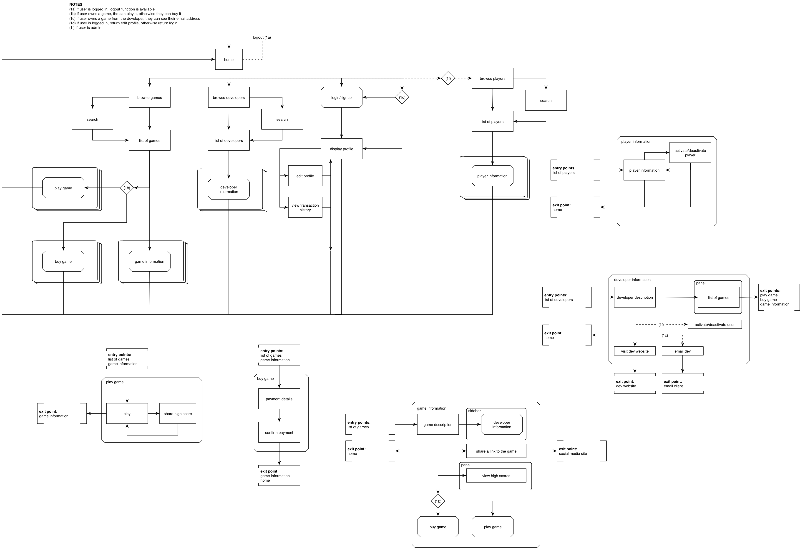
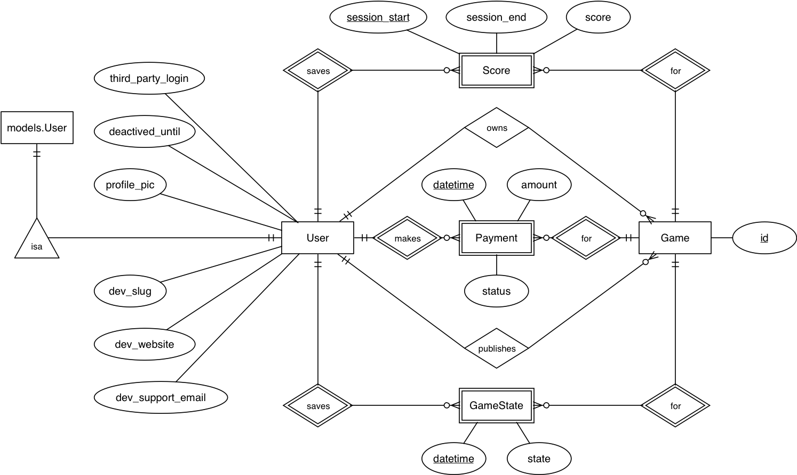

## LevelUp

[Final report](https://docs.google.com/document/d/15QNOq-CncIta7fbMhWHdsbOTx6hg6tU14yXi-KRWPmI/edit?usp=sharing)

### Setup

Download the repository:

`git clone git@git.niksula.hut.fi:munaris1/wsd_project.git`

Create a virtual environment:

`mkvirtualenv levelup`

Activate the environment:

`workon levelup`

Install requirements:

`pip install -r requirements.txt`

Create database migrations:

`python manage.py makemigrations`

Apply migrations:

`python manage.py migrate`

Apply fixtures (load data):

`python manage.py loaddata groups.json`

In development environment, to distinguish how we start the app from the production environment, we need to set an
environment variable which tell Django to use a different configuration.

`export DJANGO_DEVELOPMENT=true`

Finally, start the server:

`python manage.py runserver`

### 1. Team

- 604985 Stefano Munarini
- 427272 Simo Santala
- 597254 Phu Pham

### 2. Goal

The goal of the project is to create an online game store for JavaScript games. The project is a part of Aalto University Web Software Development course (CSE-C3210). The game store service will be built with Django deployed to Heroku.

### 3. Plans

#### 3.1. Features and Implementation

In addition to the [required functionality and features](https://plus.cs.hut.fi/wsd/2016-2017/project/description/) the service will also feature

- Administrator users with the capability of activating or deactivating (banning) user accounts
- Ability for a user to signup/login with a third party account
- Ability for a user to update their account information
- Ability for a user to see game high scores
- Ability for a user to share games and and possibly high scores on social media
- Ability for a player to save the game state
- Ability for a game to set its preferred resolution
- RESTful APIs
- Responsive user interface

#### Basic Functionality and Views

The users of the system will be divided into three groups: administrators, developers and players.
A single user account may be in one or more of these groups at the same time. The users can engage
in following actions:

###### All users

- Authentication (login/logout/signup)
- Profile update

###### Administrators

- Accept developer registration requests
- Deactivate/ban users

###### Developers

- Add a game: developers are able to add a game URL to their inventory and then set a price for it.
- Remove, update own games: after uploading games for selling, developers can delete their own games or update them (including price, url and other information)
- Game inventory: developers can see a list of their games from the inventory with sale statistics.
- Buy game from other developers: developers can also buy games developed by other people and play just like a normal player.

###### Players

- Buying games: A player can
    - Browse/search games on the store
    - View a game page
        - Buy
        - Contact the seller (email address link) (display if the player has bought the game to prevent spam)
        - Go to seller website
        - Share game
- Playing games: A player can
    - Browse their own games
    - View an information page of a game, where they can
        - Play the game
        - Share their high score of the game on social media
        - Contact the developer (email address link)
        - View their own scores
        - View game high scores
        - Go to developer website
        - Share the game page on social media
- Other: A player can also
    - View their transaction history

These actions represent the base functionality of the system. As the project develops, new functionality can be added. The following graph shows a rough sketch of how these actions can be grouped into views, and what the information architecture and interaction flow of the system will look like.

As can be seen from the graph, many of the views can be divided into modular templates. This will ensure rapid redesign and reduce bugs by removing duplicate code.

#### Authentication and permissions

To authenticate users to the system we will use the Django authentication system (see https://docs.djangoproject.com/en/1.10/topics/auth/). Django provides functionalities to authenticate, signup, login, and logout.
After a set of credentials (username and password) have been verified through the authenticate method, we are able to login a user and create a new session.

We will use either the login_required decorator (for function-based views) or the LoginRequired mixin (for class-based views) to block access to pages which require the user to be authenticated. (see https://docs.djangoproject.com/en/1.10/topics/auth/default/)

Moreover, we will set different permissions to different type of users in order to grant access to reserved pages only to some specific categories of users.

#### Game/service interaction & Save/load and resolution feature

When a user has finished playing a game, a POST request will be sent to the server containing all the information about that particular game. As we structured the database, in particular, we will need to send the score, the game_id, the user_id, and the date. The message for this request will have a messageType of type SCORE.

A user will also be able to pause a game. In this case, a POST request with a message containing a messageType of type SAVE will be sent to the server. The message will also includes information about the state of the game (gameState).

When a user wants to load a previous started game, a POST request will be sent with messageType = LOAD_REQUEST. The server will response with a LOAD messageType or an ERROR if something goes wrong.

Finally, a POST request containing a messageType of type SETTING will be sent every time a game has finished loading and it will contain configuration information (such as layout sizes).

#### 3rd party login

There are different django packages to implement 3rd party authentication. After doing some research, we decided to use ‘django-allauth’ package to support 3rd-party authentication. 

‘Django-allauth’ supports many popular providers out of the box. In this project, we only use a few of them. 
Users can login or signup with their Facebook, Google, openID or GitHub account.

In our user collection, we have field called ‘provider’ to indicate if the user was created via local authentication or a 3rd party.
All the necessary information of a user (e.g. email, name, date of birth) will be stored in our database when the 3rd party successfully authenticate the user.

Because the 3rd party provider may not have enough information to fit our user model, user will be able to update the missing information later when they get in our platform.

#### RESTful API

We will develop a set of RESTful APIs which will be used by developers to integrate our service in third party applications.

Only registered users will be allowed to use our APIs.

The APIs will require the user to be authenticated before being able to execute any request.

The APIs will have the following endpoints:
- **GET** /api/v1/developed-games which returns the list of developed games by the developer who is sending the request
- **GET** /api/v1/sales-stats which returns a set of statistics (total earnings, games sold, etc.) of the developer who is sending the request
- **GET** /api/v1/game-stats/slug which returns a set of statistics for a particular game
- **GET** /api/v1/game-search?query=query which returns a list of games which names or descriptions contain the query
- **GET** /api/v1/top-games which returns the most played and the most sold games

#### Responsive User Interface

The project will implement ZURB Foundation, which provides basic HTML, CSS and JavaScript functionality, to jump start the development. Foundation is also built for mobile and has [multiple templates](http://foundation.zurb.com/templates). [An ecommerce](http://foundation.zurb.com/templates-previews-sites-f6/ecommerce.html) template will be used for this project as the website is mainly about browsing and buying games.

> Foundation is built with HTML, CSS and Javascript, the core components of the Web.
> While Foundation is fairly cutting-edge, we use bulletproof technology like jQuery,
> HTML5 Boilerplate and Normalizr as our baseline. We then layer on top components and
> plugins designed to work well in all of our supported browsers and devices.
> 
> Since Foundation only uses front-end technology, it has no incompatibilities with
> back-end or server technology and has been used with everything from Wordpress and
> Drupal to .Net.

#### Social Media Sharing

The most basic type of social media sharing is sharing links. For this type of sharing the service will implement [Open Graph](https://ogp.me) and [Twitter Cards](https://dev.twitter.com/cards/overview) so that links that point to information pages for a game or a developer will include relevant pictures and an excerpt of the game or developer description.

As Open Graph is supported by Facebook, Pinterest and Google Plus, combining it with Twitter Cards
will cover the largest social networks in Europe and North America.

The service will possibly also allow the users to share their high scores on social media. On Facebook, for example, this requires [acquiring an access token and submitting the service for a review](https://developers.facebook.com/docs/opengraph/getting-started). As this project is only for school and not an actual public web service, this feature may not be implemented.

#### 3.2. Models

### 4. Priorities

We will start the implementation of the project from the models. After that, we will implemente the authentication system using Django internal authentication system.
Once the authentication has been completed, we will be ready to start to implement the basic functionalities for all the users (homepage, profile-page). After that we will split the work to implement both the developer and the player functionalities. At this stage we will also implement some unit test in order to guarantee the correct output and business logic for sensible functionalities.
Once the whole implementation is working properly, we will focus on developing RESTful APIs, social media sharing button and third-party signin.
We will finally implement our own game, as well as some admin functionalities.

### 5. Process and Time Schedule

#### 5.1. Process

To deliver a good product, this project requires a lot of time and commitment from all of our members. In order to manage time and avoid wasting resources, we follow the following process:

- **Design and stick to plan**: in the beginning of the project, we discuss and develop a list of features, tasks and a projected schedule to complete the tasks. We use Trello as our project management tool.
- **Prioritize the task and focus on the most important ones**: Based on the list of tasks and features, we give each task a specific priority point indicating the importance level of the task. The task with highest priority point will be on top of the list and will be implement before other tasks. Additional features and tasks will be marked with low priority and will be considered to be implemented when all basic features are completed.
- **Assign tasks for each member**: The project timeline will be divided into several sprints. In each sprint, we will assign tasks for each member. At the end of the sprint, we will have a sprint meeting to discuss about what have been completed and what have not. Sprint meeting is also the time when we will be planning the workload of the next sprint.
- **Estimate resource availability**: we plan the sprint according to available time and resources. The workload will be much less during a holiday season such as Christmas and New year.
- **Develop and control project schedule**: the schedule will be first estimated based on the task list we have. However, the schedule will be adjusted and updated during the development process.
- **Testing and fixing bugs**: In normal process, it is a good idea to keep testing the current application during the lifetime of the project. However, in this project, testing might take a lot of time and effort, so we are not able to do that. Instead, the main testing phase will happen near the end of the project. But important features will always be tested while we implementing them.

#### Communication

Even though we will not have daily meetings, we will organize face-to-face meeting at least once each sprint. This is the most suitable and efficient option for us. Moreover, we also communicate through Telegram and Skype.

#### 5.2. Timetable

##### Sprint 1, week 51

- 20.12.2016:
    - Project Plan submission (models defined)
- 23.12.2016:
    - URL Scheme defined and Django (+ Foundation) installed, project setup
- 24.12.2016. Models implementation + authentication

##### Sprint 2, week 51 - Christmas and New Year

- 31.12.2016: 
    - Add HTML templates
- 31.12.2016: 
    - Basic user functionalities

##### Sprint 3, weeks 1 & 2

- 07.01.2016: 
    - Player functionalities: buy game, high score
	- Developer functionalities: add, edit, delete game
- 14.01.2017:
    - Payment, search games, save game state, developer inventory, sale statistics

#### Sprint 4, weeks 3 & 4
- 21.01.2017:
    - Message service
    - 3rd party authentication
    - Responsiveness
	- Social media sharing
- 28.01.2017:
    - Admin features
    - Own game (if applicable)
    - Testing

##### Sprint 5, weeks 5 & 6

- Whole sprint:
    - Bug fixing  and finalization
    - Complete documentation
	- Writing and submitting final report

### 6. Testing

The project will be tested both manually and by creating unit tests where applicable. Manual testing will consist of using the service and trying out its different features by external actors. Their actions will be observed and collected in a document, in order to improve the usability of the system. This should provide insight on possible problems in the UI and possible bugs in handling the interaction flow. Manual testing also includes the use of variety of validation software, such as code validators, but also the Open Graph validation systems that are provided by different social media network sites.

Unit testing will be conducted on user permissions and authentication, the URL scheme (testing response code, content etc.) and the APIs.

### 7. Risk Analysis

Following is a list of possible risks during the project development and how they can be combatted.

- __Loss of a team member__ Frequent commits
- __Running out of time__ Prioritize the required features and leave extra ones for later development
- __Finding a critical bug or flaw late in development__ Keep code modular, well structured and documented
- __Git conflicts__ Divide tasks as to minimize the risk of simultaneous editing of same code, commit often, work on different branches
- __Inadequate architecture, performance and quality__ Make reasonable decision on architecture and system design
- __Poor productivity__ Make sure everyone is on the same page, open to discussions, feedbacks
- __Lack of resources__ Plan carefully based on member's commitment to the project
- __Uncertainty of technology__ Read documentation, discuss and collaborate with other team members when having difficulties
- __Lack of tools and support__ Be active in the community of the technology
